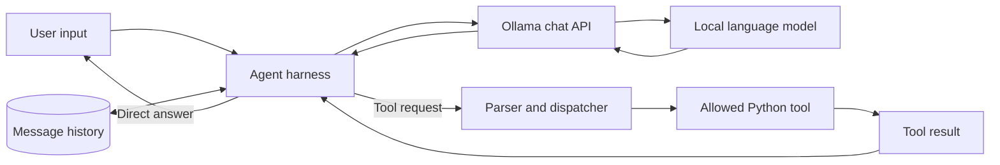
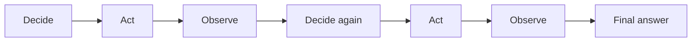

# Concepts and Architecture

## What is an agent harness?

An LLM accepts input and produces output. An agent harness is the ordinary
software around that model: prompts, message state, tools, parsers, control
loops, limits, and error handling. The harness decides what the model can do
and how model output affects the outside world.

## Message history

The Ollama chat endpoint receives a list of role-based messages. The harness
resends the relevant history on every call. This creates conversational
continuity, but the history consumes context space and must eventually be
trimmed, summarized, or stored outside the prompt.

## Tool use

A tool is a function the harness permits the model to request. A basic tool
system needs:

- a machine-readable name and argument description;
- a parser for the model's requested call;
- a registry that maps allowed names to real functions;
- argument validation and error handling; and
- a way to return results to the model.

The model proposes an action. The harness remains responsible for validating
and executing it.

## ReAct

ReAct combines iterative decision-making with actions and observations. A task
may need several model calls:

A robust loop needs a step limit, strict parsing, explicit tool permissions,
timeouts, and a clear terminal condition. Lab 03 demonstrates the shape of the
loop but deliberately leaves production concerns visible for discussion.

## Local inference with Ollama

Ollama exposes a local HTTP API. The labs send chat requests to
`http://localhost:11434/api/chat` and select `qwen2.5:7b`. Local inference
avoids a hosted API dependency, but speed and model quality depend on the
machine and selected model.
