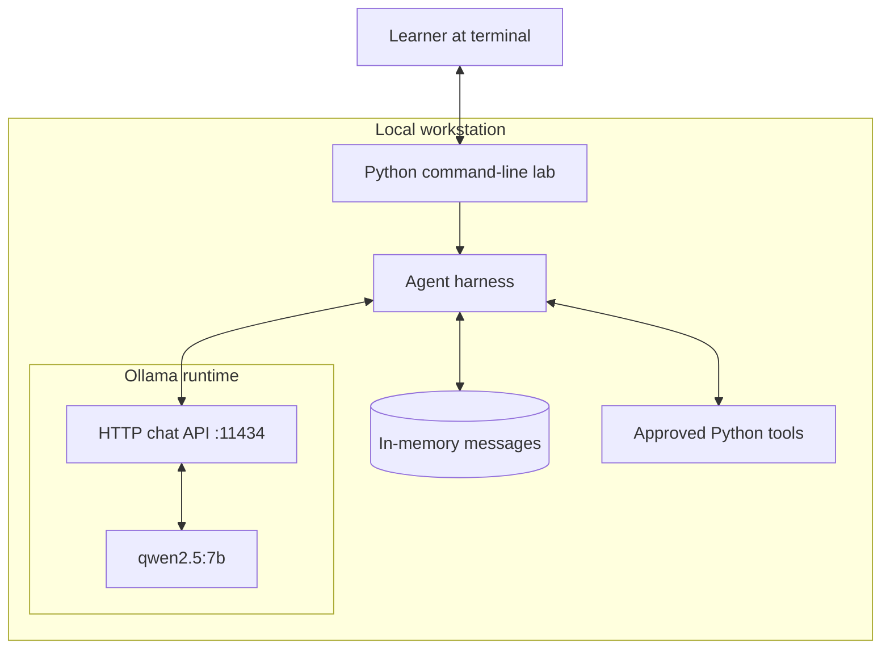
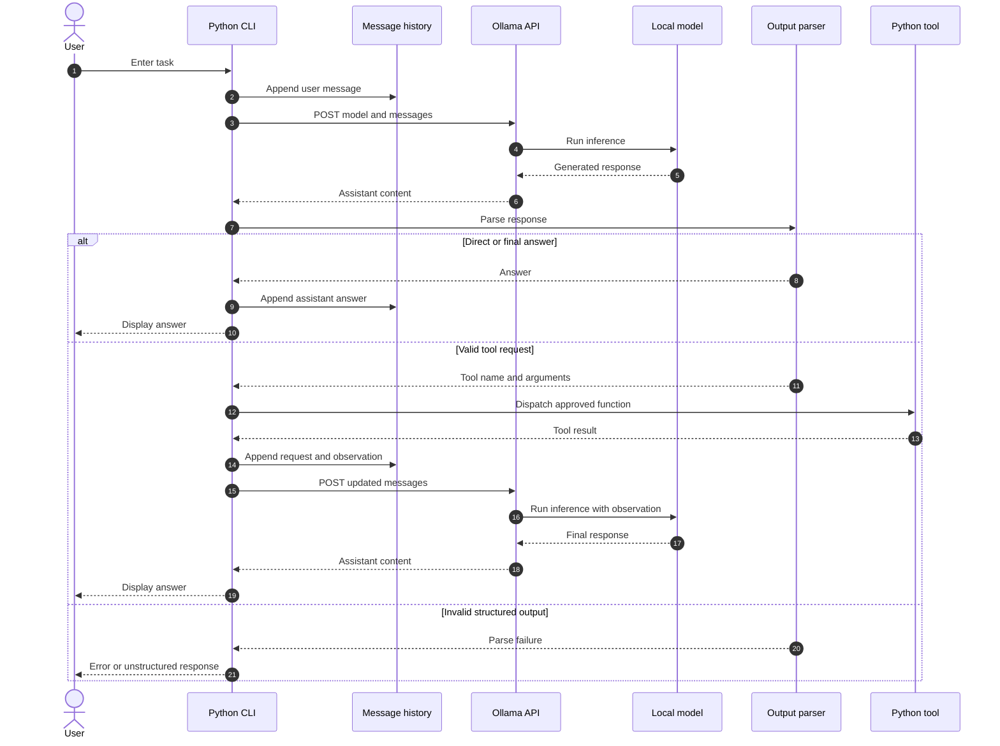
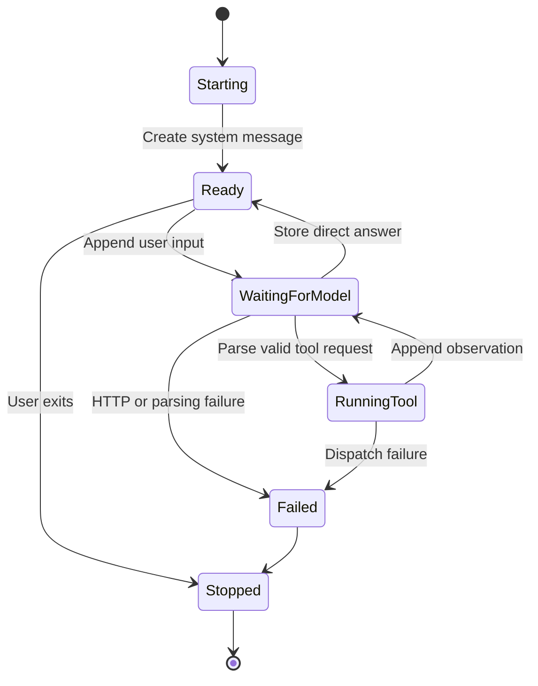
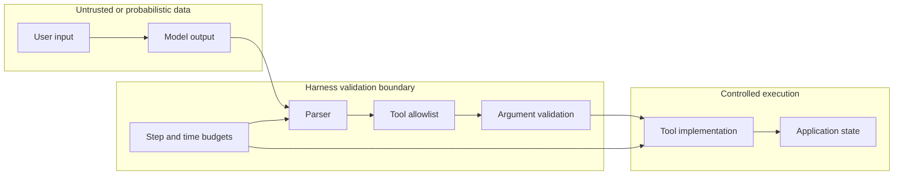
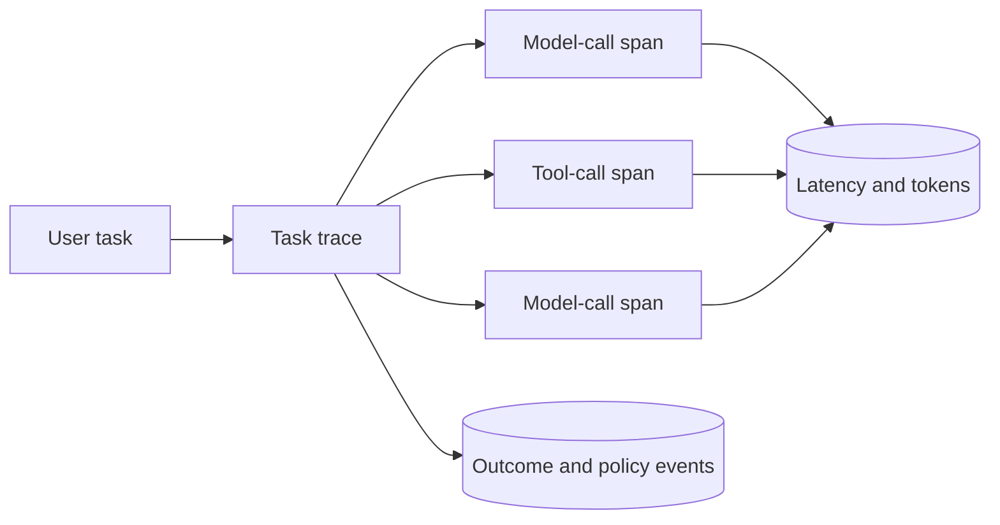
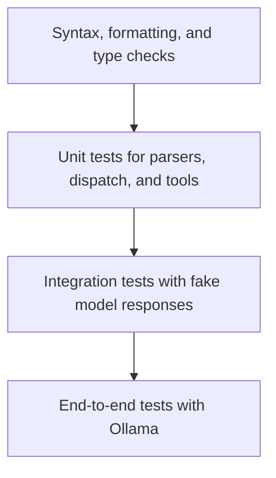
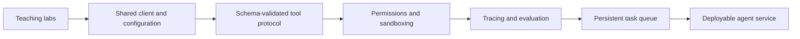

# Agent Harness Engineering Notes

These notes describe the repository as an engineered system rather than only
as three scripts. They explain component responsibilities, data movement,
interfaces, control flow, failure handling, and the changes required to move
from a teaching example toward a production service.

## 1. System purpose

The project demonstrates how deterministic application code can control a
probabilistic language model. Ollama runs the model and exposes an HTTP API.
The Python harness owns conversation state, selects the permitted actions,
executes tools, and decides when processing stops.

The central engineering rule is:

> The model may propose an action, but the harness validates and performs it.

The model is therefore one component inside the application. It is not the
application controller and does not receive direct access to Python functions,
the operating system, or external services.

## 2. System context



All components run locally. The labs do not require a cloud API key, database,
message broker, or web server.

## 3. Component responsibilities

| Component | Responsibility | Must not assume |
| --- | --- | --- |
| CLI loop | Read input, display progress, stop on exit commands | Input is valid or safe |
| Message history | Preserve the prompt and prior turns for the current process | Ollama remembers earlier requests |
| System prompt | Define behaviour and output conventions | The model will always comply |
| Ollama client | Serialize the request, call the API, enforce a timeout, parse HTTP results | The server is available |
| Output parser | Convert model text into an accepted action shape | Model output is valid JSON or ReAct text |
| Tool registry | Act as the allowlist of executable functions | Any model-provided tool name is permitted |
| Dispatcher | Validate the tool name and invoke its implementation | Arguments have the correct names or types |
| Control loop | Continue or terminate execution within a fixed budget | The model will eventually stop by itself |

## 4. Data contracts

### Ollama chat request

The scripts send an HTTP `POST` request to `/api/chat` with a body equivalent
to:

```json
{
  "model": "qwen2.5:7b",
  "messages": [
    {"role": "system", "content": "Behaviour instructions"},
    {"role": "user", "content": "The current request"}
  ],
  "stream": false
}
```

The relevant response field is:

```json
{
  "message": {
    "role": "assistant",
    "content": "Model-generated text"
  }
}
```

The labs deliberately use `stream: false`, which means the complete model
response must be generated before Python receives it.

### Message roles

| Role | Source | Meaning |
| --- | --- | --- |
| `system` | Harness author | Behaviour, constraints, and output protocol |
| `user` | Learner or harness | User request, tool result, or observation |
| `assistant` | Model | Direct answer, requested action, or final answer |

Lab 02 and Lab 03 represent tool results as `user` messages because the course
uses a simple text protocol. A production integration should use the native
tool-message format supported by its model API when available.

## 5. End-to-end data flow



The important boundary is between generated text and executable code. Model
output remains inert text until the parser and dispatcher accept it.

## 6. State and lifecycle

Conversation state exists only in the Python process:



When the process stops, its messages disappear. Persistent memory would require
a storage layer and a policy for deciding which information may be retained.

## 7. Trust boundaries



Both user input and model output must be treated as untrusted. A system prompt
is behavioural guidance, not a security boundary. Security comes from code:
allowlists, schemas, authorization checks, isolation, timeouts, and audit logs.

## 8. Failure model

| Failure | Current behaviour | Stronger engineering response |
| --- | --- | --- |
| Ollama not running | `requests` raises an exception | Health check, clear error, retry with backoff |
| Model unavailable | HTTP error | Validate model at startup and show pull command |
| Request timeout | Exception terminates the current flow | Bounded retry and cancellation |
| Empty model content | Lab 01 raises `ValueError` | Apply the same response validation in every lab |
| Invalid JSON | Lab 02 treats it as a direct answer | Validate against a schema and request one repair |
| Unknown tool | Dispatcher returns an error string | Record denial and ask model to choose an allowed tool |
| Missing arguments | Tool invocation returns an error | Validate types and required fields before execution |
| ReAct format drift | Lab 03 ends with an error response | Structured output, repair attempt, and telemetry |
| Infinite action loop | `MAX_STEPS` stops Lab 03 | Add token, cost, time, and repeated-action budgets |
| Unsafe expression | Restricted `eval` is still unsuitable for public input | Parse arithmetic with an AST allowlist or dedicated library |
| Growing history | Messages grow for the process lifetime | Token accounting, truncation, and summarization policy |

## 9. Observability

A production harness should create one trace per user task and one event per
model or tool operation. Useful fields include:

- trace identifier and step number;
- model name and generation settings;
- request duration and response duration;
- prompt and completion token counts;
- parser outcome;
- requested tool name and validated argument summary;
- tool duration and result status;
- termination reason; and
- retry or policy-denial count.

Do not log secrets, full personal data, or unrestricted tool results. Logging
needs the same data-classification policy as the application itself.



## 10. Testing strategy

Tests should be layered so most cases do not require loading a real model.



Recommended test cases:

1. Parser accepts a correct tool request.
2. Parser rejects malformed JSON without executing anything.
3. Dispatcher rejects an unknown tool.
4. Dispatcher handles missing and extra arguments.
5. A direct answer does not enter the tool path.
6. A tool result is appended before the second model call.
7. The ReAct loop returns a final answer within its limit.
8. The ReAct loop stops exactly at `MAX_STEPS`.
9. HTTP errors and timeouts produce understandable diagnostics.
10. History contains messages in the expected order.

## 11. Production evolution path



A sensible progression is:

1. Extract shared Ollama configuration and HTTP handling.
2. Replace free-form parsing with typed schemas.
3. Replace arithmetic `eval` with a safe expression parser.
4. Give every tool an explicit permission and timeout policy.
5. Add deterministic unit tests and recorded model-response fixtures.
6. Add tracing, evaluation datasets, and failure metrics.
7. Add persistent state only after defining privacy and retention rules.
8. Introduce concurrency only after tool side effects are idempotent or
   protected against duplicate execution.

The labs should remain small and readable. Production features are best built
in a separate package after learners understand the control flow shown here.
