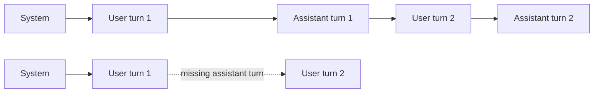

# Lab 01 Engineering Notes: Basic Agent Loop

## Objective

Lab 01 demonstrates that conversational memory belongs to the harness. The
model receives the complete relevant message list on every request; it does not
silently retain state between calls.

Source: [`lab_01_basic_agent.py`](../lab_01_basic_agent.py)

## Components

| Component | Source element | Responsibility |
| --- | --- | --- |
| Configuration | `MODEL`, `OLLAMA_URL` | Select the local model and endpoint |
| Ollama adapter | `chat` | Send messages and validate the response |
| State store | `messages` list | Hold system, user, and assistant turns |
| CLI controller | `run` | Read input, update history, and print replies |

## Request sequence

```mermaid
sequenceDiagram
    autonumber
    actor User
    participant Loop as run loop
    participant History as messages list
    participant Chat as chat function
    participant Ollama as Ollama API

    Loop->>History: Insert system message
    User->>Loop: First question
    Loop->>History: Append user message
    Loop->>Chat: chat messages
    Chat->>Ollama: POST /api/chat
    Ollama-->>Chat: Assistant response
    Chat-->>Loop: Reply text
    Loop->>History: Append assistant message
    Loop-->>User: Display reply

    User->>Loop: Follow-up question
    Loop->>History: Append user message
    Note over History,Ollama: Full history is sent again
    Loop->>Chat: chat messages
    Chat->>Ollama: POST /api/chat
    Ollama-->>Loop: Context-aware reply
    Loop->>History: Append assistant message
    Loop-->>User: Display reply
```

## Message growth

After initialization and three complete user turns, the list has seven
messages:

```text
1 system
2 user
3 assistant
4 user
5 assistant
6 user
7 assistant
```

In general, after `n` completed turns:

```text
message_count = 1 + (2 * n)
```

This linear growth also increases the prompt sent to the model. The exact token
growth depends on message length, not only message count.

## Important invariants

- The system message remains first.
- A user message is appended before its Ollama request.
- A successful assistant reply is appended before the next user turn.
- Empty input does not change history.
- Exit input does not call Ollama.
- HTTP and response validation happen before content enters history.

## Failure experiment

If the assistant append operation is removed, the next request contains user
questions without the model's previous replies. The model may still infer some
context from the user messages, but the dialogue is incomplete and follow-up
references become unreliable.



## Engineering limitations

- State is lost on process exit.
- History has no token budget or truncation policy.
- The system prompt is a behavioural instruction, not strict access control.
- Network errors are not caught in the CLI loop.
- Configuration is hard-coded rather than supplied through environment or CLI
  arguments.

## Review questions

1. Why does the second request include the first assistant response?
2. When should a long history be summarized instead of resent?
3. What data should never be stored in persistent conversation memory?
4. How would you test `chat` without running Ollama?
