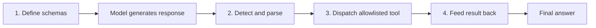
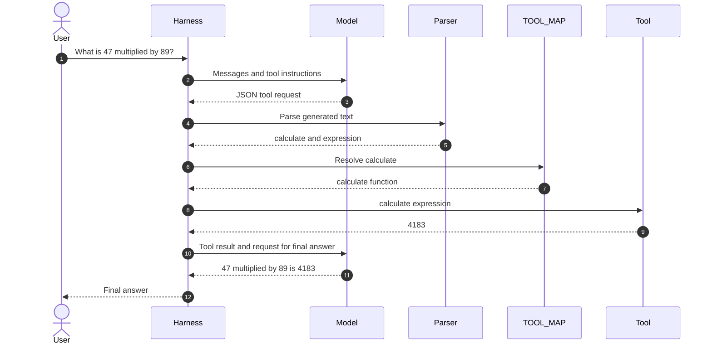
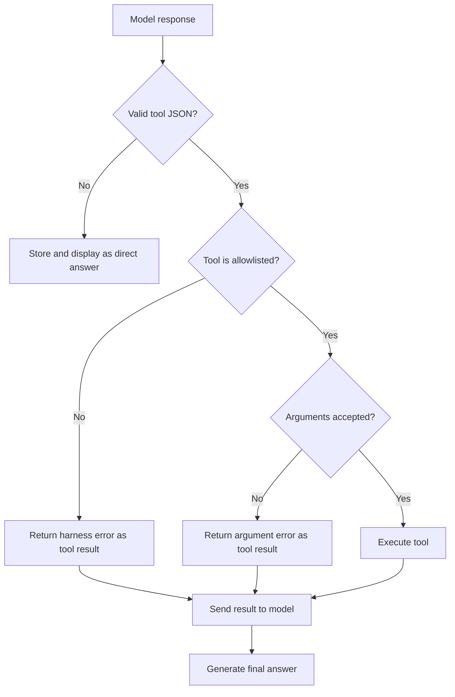

# Lab 02 Engineering Notes: Tool Harness

## Objective

Lab 02 adds controlled actions. The model describes a desired tool call in
JSON, but Python decides whether the request is recognized and executable.

Source: [`lab_02_tool_harness.py`](../lab_02_tool_harness.py)

## Four-stage tool pipeline



### Define

`TOOL_SCHEMAS` describes tool names, purposes, and expected parameters. These
descriptions are inserted into the system prompt. They help the model choose a
tool but do not validate the resulting request.

### Detect

`parse_tool_call` strips an optional Markdown fence, parses JSON, and returns a
tool name with arguments. A parsing failure currently returns `(None, {})`, so
the caller treats the response as ordinary text.

### Dispatch

`TOOL_MAP` is the executable allowlist. The dispatcher looks up the requested
name and calls the corresponding function with keyword arguments.

### Feed back

The tool result is added to the conversation. A second model call translates
the raw result into a natural-language response for the user.

## Tool-request contract

```json
{
  "tool_call": {
    "name": "calculate",
    "arguments": {
      "expression": "47 * 89"
    }
  }
}
```

The current parser verifies only that `tool_call` exists. A stronger parser
would also require:

- the root value to be an object;
- `tool_call.name` to be a non-empty string;
- `tool_call.arguments` to be an object;
- the tool name to appear in the registry; and
- parameters to match a per-tool schema.

## Tool-call sequence



## Branching behaviour



## Why the registry matters

The model can generate any string as a tool name. Only names present in
`TOOL_MAP` are executable. This separates model capability descriptions from
runtime authorization.

Adding a function to the system prompt but not the registry makes it
non-executable. Adding a function to the registry but not documenting it makes
it executable if guessed, so production systems should generate model-visible
schemas from the authorized registry rather than maintain two independent
lists.

## Security note on `calculate`

Removing built-ins from `eval` reduces obvious risks but is not an adequate
sandbox for public or hostile input. The safe design is to parse an expression
into an abstract syntax tree, allow only numeric literals and selected
arithmetic operators, and evaluate that restricted tree.

## Engineering limitations

- No formal JSON Schema validation.
- Parse failure is indistinguishable from an intentional direct answer.
- Tool errors are plain strings rather than typed results.
- Tools have no individual timeout or permission policy.
- There is no idempotency protection for tools with side effects.
- Only one tool call is supported before the final-answer request.

## Review questions

1. Why should the model never import and call arbitrary functions itself?
2. What should happen if a tool request is valid JSON but has extra arguments?
3. How would a dispatcher distinguish a retryable failure from a permanent one?
4. What additional safeguards are needed before adding a file-writing tool?
