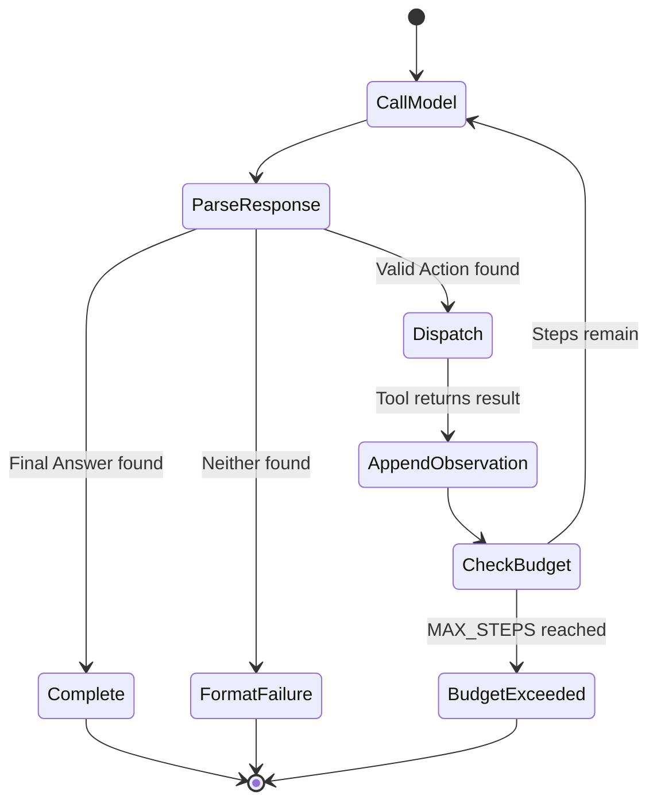
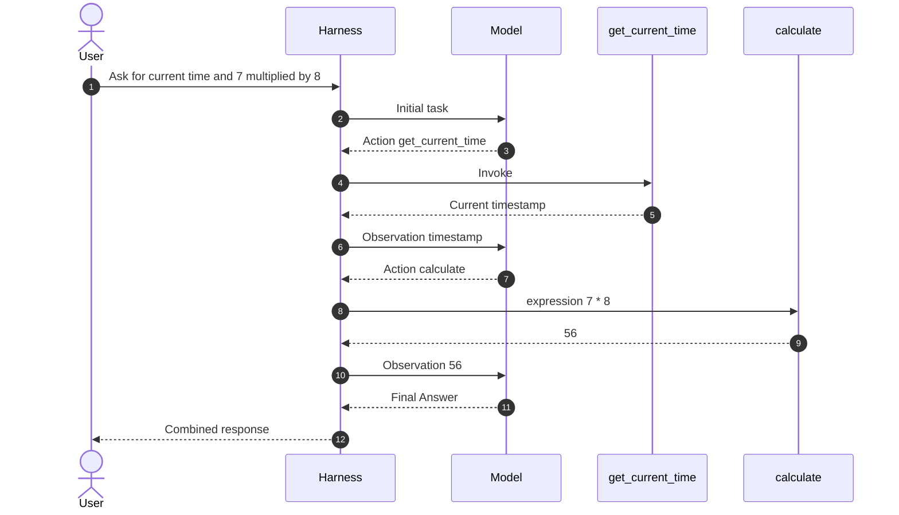
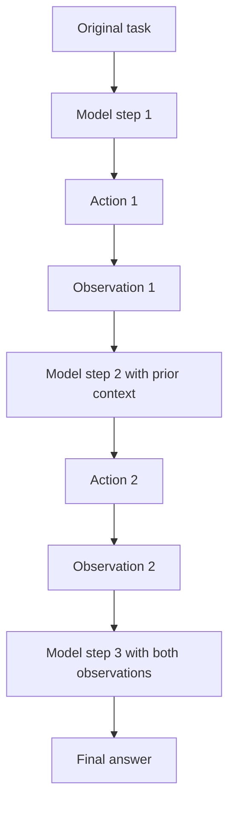
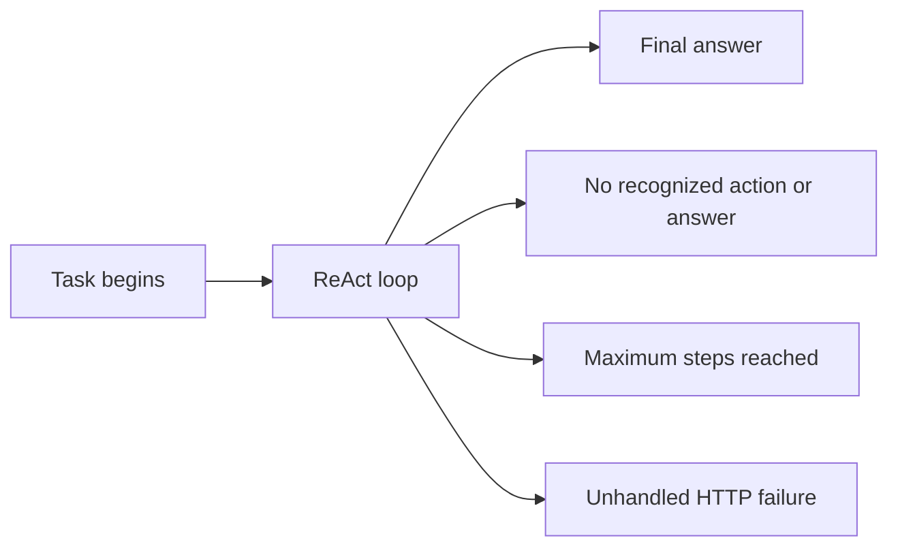

# Lab 03 Engineering Notes: ReAct Agent

## Objective

Lab 03 extends tool use into a bounded multi-step loop. The model can request a
tool, receive its observation, reconsider the task, and request another tool
before producing a final answer.

Source: [`lab_03_react_agent.py`](../lab_03_react_agent.py)

## ReAct response protocol

An action step has three fields:

```text
Thought: Decide which permitted action is required
Action: calculate
Action Input: {"expression": "7 * 8"}
```

A terminal step has two fields:

```text
Thought: The observations are sufficient to answer
Final Answer: The result is 56
```

The visible thought field is included to teach the pattern and parser. A
production application should not require hidden chain-of-thought. It should
ask for concise action rationale or structured decision metadata when an audit
record is needed.

## Control-loop state machine



## Multi-tool data flow



## Step budget

`MAX_STEPS = 6` limits the number of model responses processed for one task.
The limit protects the application from loops caused by repeated actions,
format drift, or a model that never emits `Final Answer`.

The trade-off is intentional:

| Low limit | High limit |
| --- | --- |
| Lower latency and resource use | More room for complex tasks |
| Stops loops quickly | Greater risk of repeated or costly work |
| May terminate valid multi-tool tasks | Harder to predict completion time |

A production budget should normally combine maximum steps with wall-clock
time, model-token usage, per-tool timeouts, and repeated-action detection.

## Observation accumulation



Every model call receives the original task plus previous model responses and
observations. This enables planning across steps, but the growing context also
increases inference cost and creates more opportunities for an untrusted tool
result to influence later decisions.

## Parser behaviour

`parse_react_step` scans line prefixes and collects text into four possible
fields: `thought`, `action`, `action_input`, and `final_answer`. It is easy to
read, but it assumes the model follows capitalization and prefix formatting.

Notable edge cases include:

- `Final answer:` is not the same as `Final Answer:`;
- prose before the first recognized prefix is ignored;
- invalid action-input JSON becomes an empty argument object;
- an answer containing a line beginning with `Action:` can be misclassified;
- a response containing both an action and final answer violates the prompt but
  is not rejected as an invalid combination.

## Termination reasons



A mature system should return a typed termination reason so callers can
distinguish successful completion, invalid model output, budget exhaustion,
tool failure, cancellation, and infrastructure failure.

## Engineering limitations

- The parser is text-based rather than schema-based.
- Invalid JSON silently becomes `{}`, which may hide the real model error.
- Tool observations are not marked or escaped as untrusted content.
- There is no retry policy for transient Ollama failures.
- Repeated identical actions are not detected.
- Tools cannot declare whether they are read-only or side-effecting.
- Final answers are not checked against the observations that support them.

## Review questions

1. Why is a loop limit part of correctness rather than only performance?
2. How could a malicious tool result influence the model's next action?
3. When is it safe to retry a tool call automatically?
4. How would you detect that the model is repeating the same failed action?
5. Which termination reasons should be visible to an API client?
